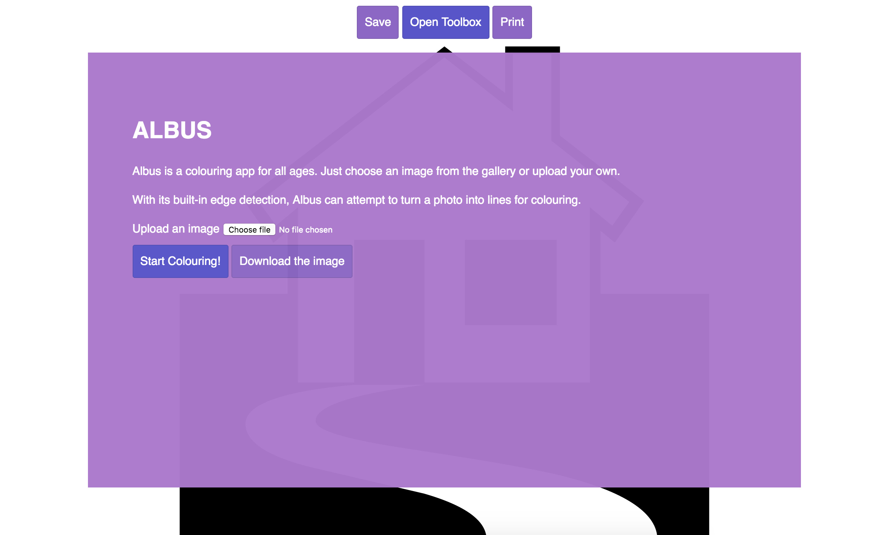
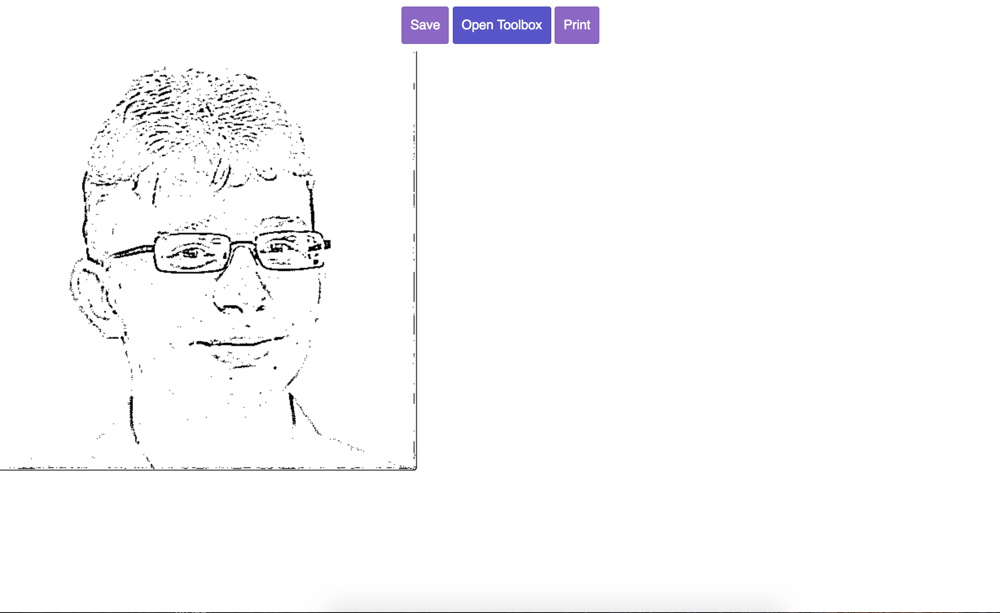
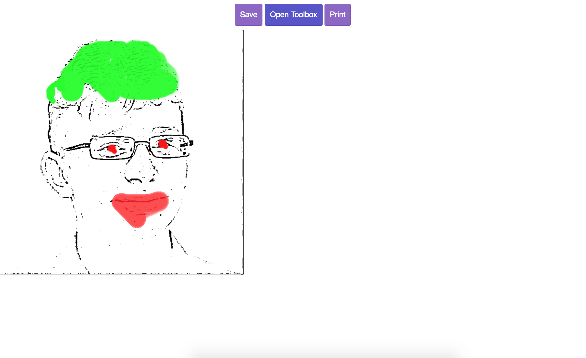

[Live Demo](https://shanehudson.net/tools/albus/) | [Development Article](https://shanehudson.net/index.php?p=2016/10/05/creating-my-10k-apart-entry)

# Albus
This is a online edge detection website that works in all browsers, including Lynx. It does this using PhantomJS to reuse client side code on the server. On browsers that support canvas, there is a basic colouring book style functionality so the user can colour in the lines created with the edge detection. Browsers that support service workers will enjoy a fully featured offline mode.

All this in under 7Kb transferred. 

## How to Install
This is a Node.js application so to install use ```npm install``` then ```node index.js```. The install will take a while due to PhantomJS being used for server side rendering.

## Screenshots




